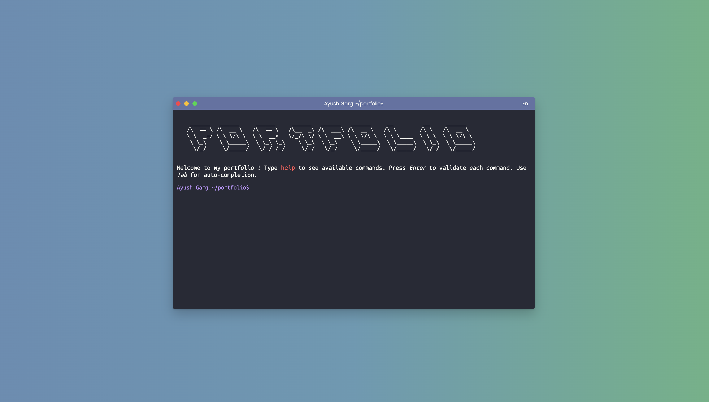

<h1 align="center">
   
  
   
Portfolio Terminal 
</h1>
<h4 align="center">Presentation of my portfolio in terminal form. The commands of a real terminal can be used on the site, however if you do not master them you will be easily guided to move around.</h4>
 

## WEB version 🌐

The site is live here 👉 [portfolio](meayushgarg.netlify.app)

## Technologies utilisées ⚙️

For this program the following technologies were used :  

 
 
The site is responsive. Enjoy your discovery !

## Credit 🔗
[Ayush Garg](https://github.com/ayushgarg2702)